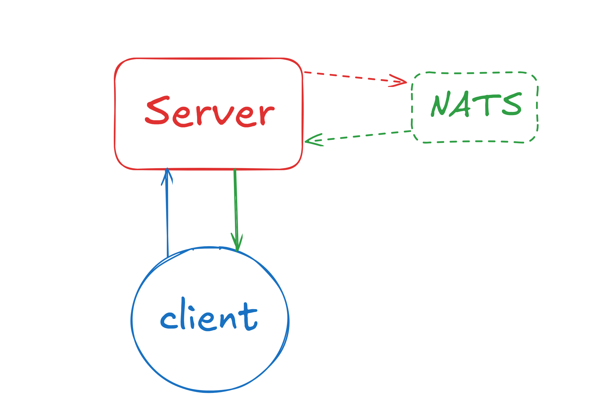
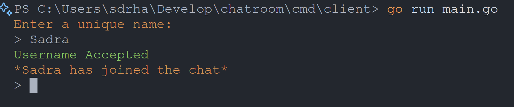
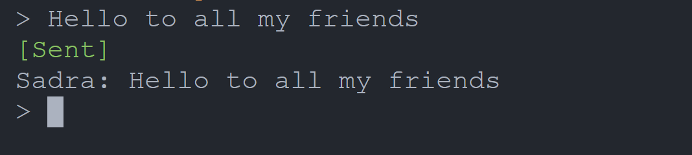
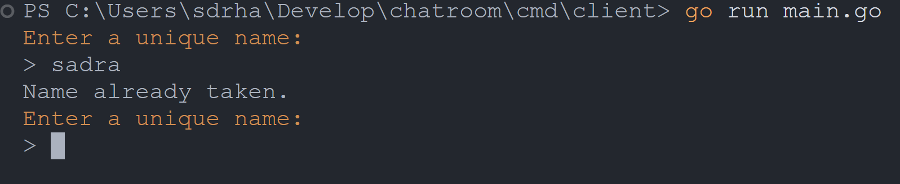
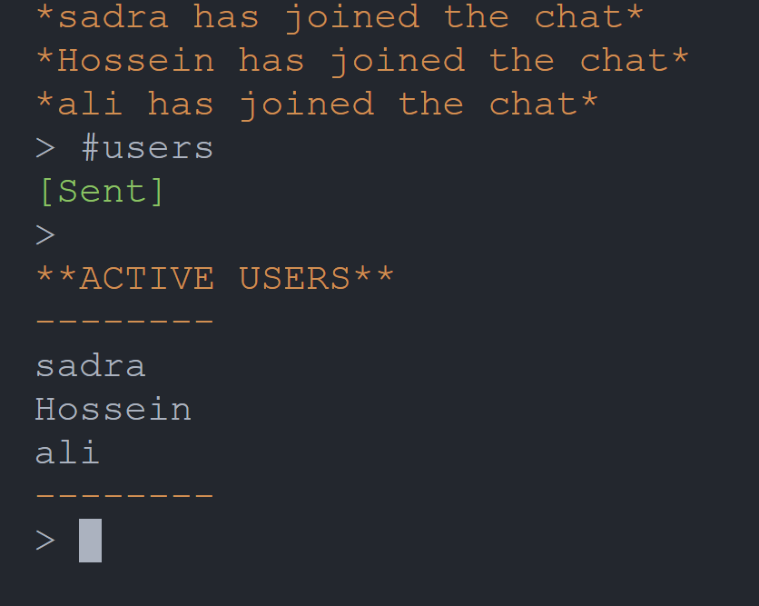

# Sadra Chatroom Application
A WebSocket-based chatroom application that uses NATS for message broadcasting and features a WebSocket client-server architecture.
---

## Table of Contents
- [Setup the server and start the client](#how-to-start)
- [Features](#features)
- [Environment Variables](#environment-variables)
- [Running Tests](#running-tests)
- [App system design](#app-system-design)
- [Code and Modules structures](#code-and-modules-structures)
- [How some of the code works](#how-some-of-the-code-works)
- [Dependecies](#dependencies)


## How to start
first you need to run ``` docker-compose up -d ```
to run the server and NATS cluster. and don't forget to set the name of the .env.example to .env
then go to the /cmd/client directory to run the client application
```cd ./cmd/client``` and run the main.go ```go run main.go```
after that you can interact with the CLI and first you should enter a unique username to be able to chat with others

## Features
- users can press ^C to logout from the chatroom.
- joining and leaving of the users will be shown in the chatroom. like **User has join the chatroom**.
- usernames must be unique and the server would check this uniqness and if it's not the user is prompted to enter their name again.
- after user has successfuly sent their message to the chatroom the server will send an OK to the user and the CLI will show a [Sent] to the user.
- colorful prompts for the user.
- by typing #users and sending to the server it will show a list of currently active users to the user.
- by typing /exit the user will be exited and the leave message would be sent to the chatroom and everyone can see they left.

---
## Environment variables
- ```APP_NAME=Chatroom```
- ```APP_PORT=0.0.0.0:8080```
- ```APP_SERVER_URL=ws://127.0.0.1:8080/ws```

- ```NATS_URL=nats://localhost:4222```
- ```NATS_CHATROOM_SUBJECT=chat```

---
## Running tests
for running the test you should first have the server and NATS up and running. you can 
do this by looking at [Setup the server and start the client](#how-to-start)
then, come to the tests directory and enter ```go test server_function_test.go -v```

---
## App system design


first the client connects to the server and server requests credentials like username, after that client joins the chatroom and can send messages (blue line).
after it sends a message the server send an Ack messsage back to the user so the user knows the message has been sent. then server publish the message to the NATS and server itself subscribe to the "chat" queue to the NATS and receive the message from the queue and publishe to all the active clients which are connected to the server

---
## Code and Modules structures
I have internal directory which has all the logics for server and client applications, in the internal there is a directory for configurations which read the config from .env and implements it into the server and client modules.
then I have pkg directory which containes all the custom libs and objects for server and clients or shared libs for serializing and deserilizing messages.
ui library in the pkg for client side messaging and showing the messages and prompts in the CLI. 
and internal/app directory which containes basic setup for server and client respectfully

---
## How some of the code works
### #client
it has a simple start method which has a flow: 
```
func (c *Client) Start() {
	defer c.conn.Close()

	interrupt := make(chan os.Signal, 1)
	signal.Notify(interrupt, syscall.SIGINT, syscall.SIGTERM)

	if !c.handleUsernameSetup() {
		ui.DisplayError("Failed to set up username. Exiting...", true)
		return
	}

	go c.readMessages()
	go c.writeMessages()

	select {
	case <-c.done:
	case <-interrupt:
		ui.DisplayError("Interrupt signal received, shutting down...", true)
		c.conn.WriteMessage(websocket.CloseMessage, websocket.FormatCloseMessage(websocket.CloseNormalClosure, ""))
	}
}
```
it has channels for graceful shutdown and when the user presses ^C.
it also has 2 goroutines for reading and writing the messages to the server as well
and then a select to when the user want to shutdown for singaling the shutdown


### #Server
```
func (h *Handler) WebSocketHandler(w http.ResponseWriter, r *http.Request) {
	ws, err := upgrader.Upgrade(w, r, nil)
	if err != nil {
		log.Println("Websocket upgrade failed: ", err)
		return
	}

	userName, err := h.captureClientName(ws)
	if err != nil {
		log.Printf("Error capturing client username: %v", err)
		ws.Close()
		return
	}

	h.Pool.AddConnection(userName, ws)
	log.Println("Client connected successfully:", userName)

	// message broadcast to all active users that someone has joind just now
	h.joindMessagePublish(userName)
	h.reader(userName, ws)

}
```
the server main component is the websocket handler which is located in the internal/handlers/websocket.go
it has a http handler for the user to connect to and then an upgrader which upgrades the http connection to a websocket.
when someone new connect to the chatroom; it prompts the user to send a unique username and it checks with the map of users to their webosocket connetions and it the username is not unique, it tries again to get input from the user, then greets them and send a message to the chatroom that the new user has joind the chat.
then the reader() method comes and stays to read all the message that client sends to the server.

some of the messages that server sends to clients are json so the client app can understand what to show to user in what format which looks like this in the client side:
```
case "users":
			if users, ok := msg.Data.([]interface{}); ok {
				ui.DisplayUsers(users)
			} else {
				ui.DisplayMessage("Invalid users list recieved. cannot show")
			}
		case "chatroom":
			ui.DisplayNeutral(msg.Data.(string))
		case "ack":
			ui.DisplaySuccess("[Sent]")
		default:
			ui.DisplayError(fmt.Sprintf("Unknown message type: %s", msg.Type), false)
```
this way the client knows that when something with the msg.Type users comes to it, it must show it as a list of active users, or when the user sends something to the server it should recieve and OK from the server which is translated to [Sent] for the user to see that his message has succesfully has been sent.

### #visual pictures so you can grasp of things that this app does

This is when the user connects to the server and just joind in.


This is when the user sends a message to the server and recieves the Ack message


This is when the user enters a username that has been taken.


And this is when the user want to see a list of active users.

---
## Dependencies
- gorilla websocket --> github.com/gorilla/websocket
- nats library for golang --> github.com/nats-io/nats.go
- tool for reading the .env file --> github.com/joho/godotenv