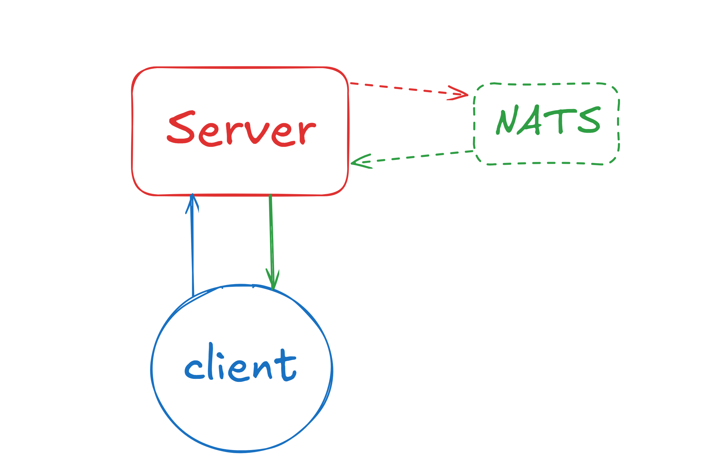

# Sadra Chatroom Application
A WebSocket-based chatroom application that uses NATS for message broadcasting and features a WebSocket client-server architecture.
---

## Table of Contents
- [Setup the server and start the client](#how-to-start)
- [Features](#features)
- [Environment Variables](#environment-variables)
- [Running Tests](#running-tests)
- [App system design](#app-system-design)
- [Code and Modules structures](#code-and-modules-structures)
- [Dependecies](#dependencies)


## How to start
first you need to run ``` docker-compose up -d ```
to run the server and NATS cluster.
then go to the /cmd/client directory to run the client application
```cd ./cmd/client``` and run the main.go ```go run main.go```
after that you can interact with the CLI and first you should enter a unique username to be able to chat with others

## Features
- users can press ^C to logout from the chatroom.
- joining and leaving of the users will be shown in the chatroom. like **User has join the chatroom**.
- usernames must be unique and the server would check this uniqness and if it's not the user is prompted to enter their name again.
- after user has successfuly sent their message to the chatroom the server will send an OK to the user and the CLI will show a [Sent] to the user.
- colorful prompts for the user.
- by typing #users and sending to the server it will show a list of currently active users to the user.
- by typing /exit the user will be exited and the leave message would be sent to the chatroom and everyone can see they left.

---
## Environment variables
- ```APP_NAME=Chatroom```
- ```APP_PORT=0.0.0.0:8080```
- ```APP_SERVER_URL=ws://127.0.0.1:8080/ws```

- ```NATS_URL=nats://localhost:4222```
- ```NATS_CHATROOM_SUBJECT=chat```

---
## Running tests
for running the test you should first have the server and NATS up and running. you can 
do this by looking at [Setup the server and start the client](#how-to-start)
then, come to the tests directory and enter ```go test server_function_test.go -v```

---
## App system design


first the client connects to the server and server requests credentials like username, after that client joins the chatroom and can send messages (blue line).
after it sends a message the server send an Ack messsage back to the user so the user knows the message has been sent. then server publish the message to the NATS and server itself subscribe to the "chat" queue to the NATS and receive the message from the queue and publishe to all the active clients which are connected to the server

---
## Code and Modules structures
I have internal directory which has all the logics for server and client applications, in the internal there is a directory for configurations which read the config from .env and implements it into the server and client modules.
then I have pkg directory which containes all the custom libs and objects for server and clients or shared libs for serializing and deserilizing messages.
ui library in the pkg for client side messaging and showing the messages and prompts in the CLI. 
and internal/app directory which containes basic setup for server and client respectfully


## Dependencies
- gorilla websocket --> github.com/gorilla/websocket
- nats library for golang --> github.com/nats-io/nats.go
- tool for reading the .env file --> github.com/joho/godotenv